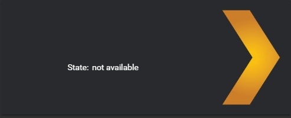

# Static Text Element

This element is **not** all that useful as a card (it can be used for that to), the purpose of this is to give the option to add static text on a `picture-elements` card.

## Options

| Name | Type | Default | Description
| ---- | ---- | ------- | -----------
| type | string | **Required** | `custom:text-element`
| text | string | **Required** | The text you want to show.

## Installation

### Step 1

Install `text-element` by copying `text-element.js`from this repo to `<config directory>/www/text-element.js` on your Home Assistant instanse.

**Example:**

```bash
wget https://raw.githubusercontent.com/custom-cards/text-element/master/text-element.js
mv text-element.js /config/www/
```

### Step 2

Link `text-element` inside you `ui-lovelace.yaml`.

```yaml
resources:
  - url: /local/text-element.js?v=0
    type: js
```

### Step 3

Add a custom element in your `ui-lovelace.yaml`

```yaml
      - type: picture-elements
        image: /local/files/LUfuf8ow.jpg
        elements:
          - type: custom:text-element
            text: "State:"
            style:
              top: 59.6%
              left: 26.8%
```

## Usage example

```yaml
title: Home Assistant
views:
  - title: default_view
    icon: mdi:home
    cards:
      - type: picture-elements
        image: /local/files/LUfuf8ow.jpg
        elements:
          - type: state-label
            entity: sensor.tautulli__ludeeus
            style:
              top: 50%
              left: 30%
              transform: none
          - type: custom:text-element
            text: "State:"
            style:
              top: 59.6%
              left: 26.8%
```

**Give this result:**\


## Credits

- [ludeeus](https://github.com/ludeeus)
- [ciotlosm](https://github.com/ciotlosm)